# RedCarpet — Base de datos (diccionario + relaciones)

> Documento autoexplicativo para inspección y análisis externo.
> Motor: **PostgreSQL 15 (Supabase)** con extensiones **PostGIS** (geometría) y **pgRouting** (rutas).
> Todas las tablas de datos de usuario tienen **RLS (Row Level Security)** activado: cada usuario solo
> puede leer sus propios datos; el acceso amplio se hace con el rol de solo lectura (ver §Acceso).

---

## 1. Cómo acceder (solo lectura)

**Opción A — Panel de Supabase (recomendado, lo más simple):**
Entra en [supabase.com](https://supabase.com) con la cuenta de RedCarpet → proyecto → **Table Editor**
(navegar tablas) y **SQL Editor** (consultas). Es acceso real y no requiere credenciales aparte.

**Opción B — Rol de solo lectura `analyst_readonly` (para un analista con cliente SQL):**
- Puede **SELECT** en todas las tablas de `public`. **No** puede INSERT/UPDATE/DELETE ni cambiar esquema.
- Falta ponerle contraseña (no se deja en texto por seguridad). En el SQL Editor de Supabase:
  ```sql
  ALTER ROLE analyst_readonly WITH PASSWORD 'la-que-elijas';
  ```
- Cadena de conexión: Supabase → Project Settings → Database → Connection string, sustituyendo
  el usuario por `analyst_readonly`.
- **Qué puede hacer:** consultar y exportar cualquier tabla. **Qué NO:** modificar/borrar nada.

---

## 2. Diagrama de relaciones (ER)

```mermaid
erDiagram
    profiles ||--o{ locations : "registra ubicación"
    profiles ||--o{ trusted_contacts : "tiene contactos"
    profiles ||--o{ subscriptions : "tiene suscripción"
    profiles ||--o{ push_tokens : "dispositivos"
    profiles ||--o{ saved_places : "lugares guardados"
    profiles ||--o{ emergency_contacts : "contactos SOS"
    profiles ||--o{ sos_alerts : "lanza alertas"
    profiles ||--o{ green_user_stats : "aporte CO2"
    profiles ||--o{ green_contributions : "rutas CO2"
    profiles ||--o{ location_consent_log : "consentimiento ubicación"
    profiles ||--o{ business_listings : "negocios"
    profiles ||--o{ family_members : "pertenece a grupo"
    family_groups ||--o{ family_members : "miembros"
    family_groups ||--o{ safe_zones : "zonas seguras"
    family_groups ||--o{ sos_alerts : "alertas del grupo"
    sos_alerts ||--o{ sos_recordings : "grabaciones"
    cities ||--o{ neighborhoods : "barrios"
    cities ||--o{ authority_alerts : "avisos autoridad"
    cities ||--o{ crime_stats_municipal : "estadísticas"
    neighborhoods ||--o{ neighborhood_scores : "puntuación seguridad"
    neighborhoods ||--o{ neighborhood_signals : "señales"
    authority_alerts ||--o{ danger_zones : "zona derivada"
    green_community ||..|| green_contributions : "agrega (contador comunidad)"
```



*(`profiles` = usuario; extiende `auth.users` de Supabase. `green_community` es una fila única
que agrega el total real de CO₂; el resto es simulado en cliente.)*

---

## 3. Diccionario de datos por dominio

### 3.1 Usuarios y cuenta
| Tabla | Propósito | Campos clave | Origen del dato |
|---|---|---|---|
| **profiles** | Perfil del usuario (extiende auth.users) | id, full_name, phone, email, sos_pin, onboarding_completed, habitual_city, risk_exposure_level | Registro + onboarding + ajustes |
| **subscriptions** | Estado Premium por usuario | user_id, plan_id, status, expires_at, revenuecat_id | Compra RevenueCat/Stripe (webhook) |
| **push_tokens** | Tokens de notificaciones por dispositivo | user_id, token, platform | Al conceder notificaciones |

### 3.2 Ubicación (dato central)
| Tabla | Propósito | Campos clave | Origen |
|---|---|---|---|
| **locations** | Histórico de posiciones GPS (real-time + histórico). **Retención 30 días** (cron diario, alineado con la política) | user_id, lat, lng, accuracy, speed, battery_level, created_at | Rastreo foreground/background |
| **location_consent_log** | Nivel de permiso concedido y cuándo (demostrar consentimiento) | user_id, level (denied/foreground/always), platform, recorded_at | Servicio de permisos |
| **saved_places** | Lugares guardados por el usuario (Casa, Trabajo…) | user_id, name, lat, lng, icon | El usuario |
| **safe_zones** | Zonas seguras (geofences) de un grupo familiar | family_id, name, lat, lng, radius | "Añadir zona segura" |

### 3.3 Familia y contactos
| Tabla | Propósito | Campos clave | Origen |
|---|---|---|---|
| **family_groups** | Grupos de confianza | name, admin_id, invite_code | Crear grupo |
| **family_members** | Pertenencia usuario↔grupo | group_id, user_id, role, permissions | Unirse por invite |
| **trusted_contacts** | Contactos de confianza. `status`: pending/accepted/rejected/**invited** (invitado sin cuenta) | user_id, name, phone, associated_user_id, status | Añadir contacto/agenda |
| **emergency_contacts** | Contactos a notificar en SOS | user_id, name, phone, notify_on_sos | Config SOS |
| **contact_check_log** | Log anti-enumeración (rate limit de comprobaciones de cuenta) | user_id, checked_at | Comprobar si un contacto tiene cuenta |

### 3.4 SOS / seguridad activa
| Tabla | Propósito | Campos clave | Origen |
|---|---|---|---|
| **sos_alerts** | Alertas SOS lanzadas | user_id, group_id, lat, lng, status, media_*, context_payload | Botón SOS |
| **sos_recordings** | Grabaciones (audio/vídeo) por segmentos de un SOS | sos_alert_id, storage_path, chunk_index, media_type, expires_at, preserved | Grabación SOS |

### 3.5 Mapa de seguridad (datos de zona)
| Tabla | Propósito | Origen |
|---|---|---|
| **cities** | Ciudades soportadas (con boundary PostGIS) | Configuración |
| **neighborhoods** | Barrios/distritos (boundary, centroid) | Importación datos abiertos |
| **neighborhood_scores** / **neighborhood_signals** | Puntuación de seguridad por barrio + señales | ETL scoring |
| **crime_stats_municipal** | Estadísticas oficiales de criminalidad | Importación MIR/INE |
| **danger_zones** | Zonas de peligro (reportadas por usuarios o derivadas de autoridad) | Usuarios + autoridad |
| **authority_alerts** / **authority_audit_log** | Avisos de autoridades + auditoría | Panel autoridades |
| **dashboard_users** | Usuarios del panel de autoridades (rol/ciudad) | Alta manual |

### 3.6 Green Carpet (impacto CO₂)
| Tabla | Propósito | Campos clave | Origen |
|---|---|---|---|
| **green_user_stats** | Aporte individual acumulado | user_id, total_co2_kg, total_km, routes_count | Al iniciar una ruta (0,12 kg CO₂/km) |
| **green_contributions** | Cada ruta contada (dedupe/auditoría) | user_id, route_key, distance_km, co2_kg | Al iniciar una ruta |
| **green_community** | Fila única: CO₂ real agregado de la comunidad | real_co2_kg | Suma atómica por ruta (parte simulada = en cliente) |

### 3.7 Negocios (monetización)
| Tabla | Propósito | Campos clave | Origen |
|---|---|---|---|
| **business_listings** | Negocios destacados (mapa + buscador) y promos | name, lat, lng, is_active, paid_until, promo_tier (social_49/plus_99), promo_status (pendiente/publicado) | Alta de negocio + Stripe |
| **revu_clicks** / **revu_review_stats** | Métricas de reseñas/clics de negocios | slug, rating, review_count | Tracking |

### 3.8 Coste Mapbox (panel /spend)
| Tabla | Propósito | Origen |
|---|---|---|
| **mapbox_budget** | Uso/coste agregado por producto y mes | Contador cliente `track()` (reconciliado con dashboard Mapbox) |
| **mapbox_user_usage** | Cupo mensual por usuario (anti-abuso) | Por llamada |
| **mapbox_budget_log** | Eventos de umbral (aviso €10 / bloqueo €50) | Al cruzar umbral |
| **mapbox_geocache** | Caché de geocoding inverso (ahorro de coste) | Reverse geocode |

### 3.9 Interno
| Tabla | Propósito |
|---|---|
| **todo_tasks** | Tablero de tareas interno (/todo) |

---

## 4. Escalabilidad — hecho y pendiente

### Aplicado ahora
- **Índice clave verificado**: `locations(user_id, created_at DESC)` — la consulta más frecuente
  (últimas posiciones por usuario) ya usa índice, no escaneo completo.
- **Retención `locations` = 30 días** (cron diario) → la tabla no crece sin límite.
- **Índice `business_listings(is_active)`** (parcial) para mapa/buscador.
- **FKs añadidas** `green_contributions.user_id` y `business_listings.user_id` → `profiles ON DELETE CASCADE`
  (integridad + derecho de borrado: al eliminar la cuenta no quedan datos huérfanos).
- **RLS activado** en `contact_check_log`; **policy de lectura propia** en `green_contributions`.
- Contactos, SOS, suscripciones, push: ya tenían índices por `user_id`/estado.

### Pendiente (con justificación)
- **Búsqueda de negocios por nombre (ilike)**: hoy hay pocos negocios; cuando crezcan, añadir índice
  **trigram** (`pg_trgm`) sobre `business_listings.name`. No se hace ya porque el volumen es mínimo.
- **Particionado de `locations`** por fecha si el volumen sube mucho (con 30 días de retención,
  probablemente no haga falta a medio plazo).
- **Avisos del linter de Supabase** (no críticos): 2 vistas `SECURITY DEFINER` y ~12 funciones sin
  `search_path` fijo (hardening menor); activar en Auth la protección de contraseñas filtradas
  (HaveIBeenPwned) — es un toggle del panel.

### Plan/tier y backups (verificar en el panel)
- **Backups**: Supabase hace copia diaria automática en los planes de pago (Pro: 7 días de retención;
  con PITR opcional). **Acción para el CEO:** confirmar en Project Settings → Database → Backups qué
  plan/retención hay activo; si estáis en Free, subir a Pro antes de escalar (Free no garantiza backups).
- **Conexiones concurrentes**: usar el **pooler** de Supabase (puerto 6543, modo transacción) para la app,
  no conexiones directas, para aguantar muchos usuarios. Ya aplica al usar el SDK de Supabase.
